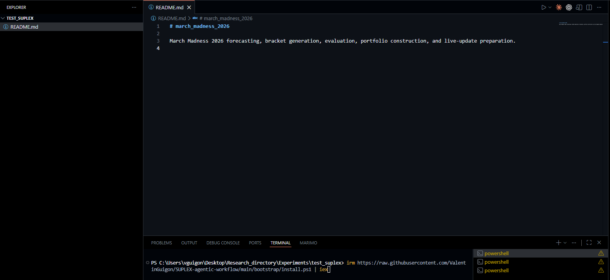
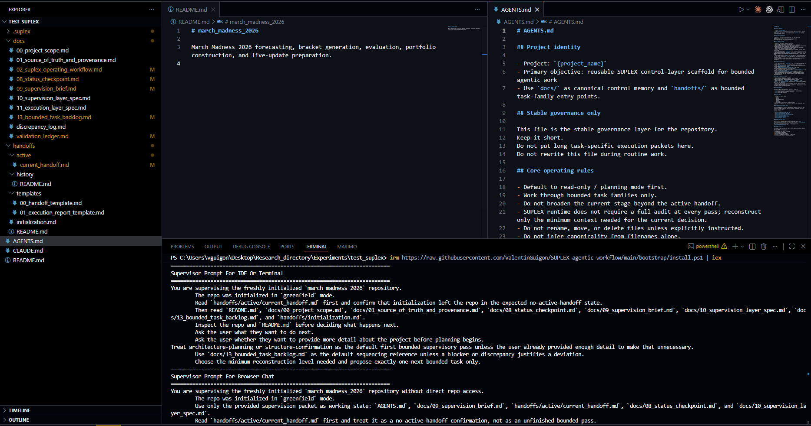
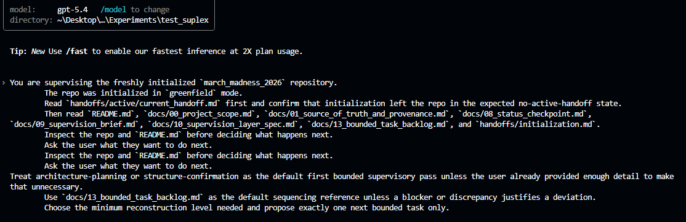
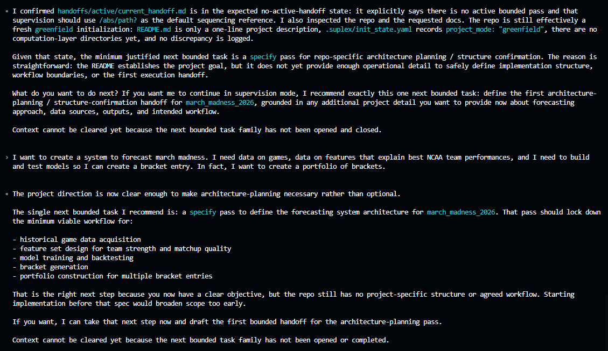
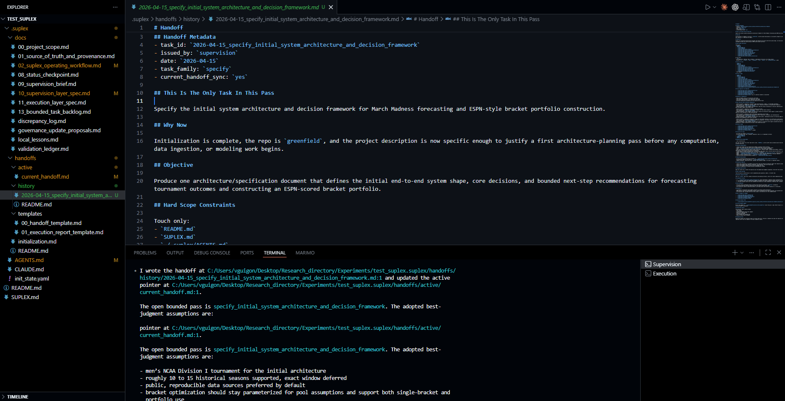
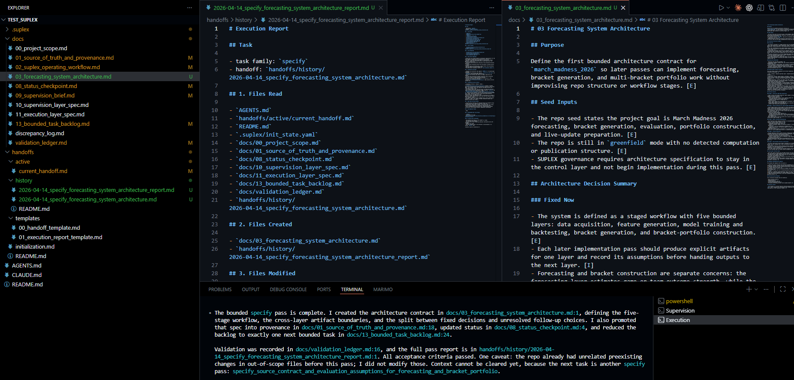
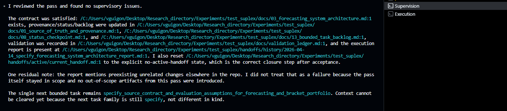

# SUPLEX Demo

This demo shows the standard SUPLEX operating loop in a small repository, from bootstrap through supervisor handoff, execution, and supervisor review.

The screenshots in this directory are regular `.png` assets embedded directly in Markdown, so this walkthrough can live as a single document.

## Step 1: Start With A Repository README

SUPLEX expects the target repository to already contain its own `README.md`. In this example, the target repo is a greenfield March Madness forecasting project with only a minimal root README.

## Step 2: Install The Workflow

From inside the target repository, run the installer. After initialization, SUPLEX adds the control-layer documentation, the validation ledger, the active and resolved task system, and the agent instructions. The bootstrap also prints the first prompt to give the supervisor.

## Step 3: Start The Supervisor

Take the prompt printed by the installer and give it to an agent acting as the supervision layer. At this point the supervisor is responsible for reading the control docs, understanding the repository state, and defining the first bounded task with you.

## Step 4: Scope The First Bounded Task

Interact with the supervisor to define the first pass. In a greenfield repository this often means clarifying architecture or structure before implementation. In an existing repository, it may mean confirming the next audit, repair, or analysis task instead.

## Step 5: Review The Handoff And Launch Execution

Once the supervisor has enough context, it writes a fairly comprehensive handoff for execution. You can edit that handoff if needed or pass it through directly. Then open a new agent session and tell it something along the lines of: `You are the execution layer. A new task awaits. Read ./.suplex/handoffs/active/current_handoff.md and execute that bounded pass.`

## Step 5a: Observe The Post-Execution State

After the execution pass completes, the repo contains both the delivered artifact and the accompanying control-layer updates. In this run, the execution layer also created a new architecture document and wrote its execution report into history.

## Step 6: Return To Supervision For Review

The execution agent finishes by writing a structured report. You then return to the supervision layer, which reviews the pass, confirms whether the contract was satisfied, records closure, and identifies the next bounded task.

## What The Demo Shows

This walkthrough demonstrates the standard SUPLEX loop:

- bootstrap the control layer into a repository that already has its own `README.md`
- hand the printed initialization prompt to the supervision layer
- use supervision to scope exactly one bounded task
- pass the generated handoff to the execution layer
- let execution return a report and any in-scope artifacts
- return to supervision for validation, closure, and next-task definition

That is the core operating pattern of `SUPLEX-standard`.

`SUPLEX-sans-sucre` follows the same supervisor-executor discipline, but with a lighter live-state setup: no dated handoff/report history, just the active handoff and active execution report. It is the same operating logic with less archival overhead.
